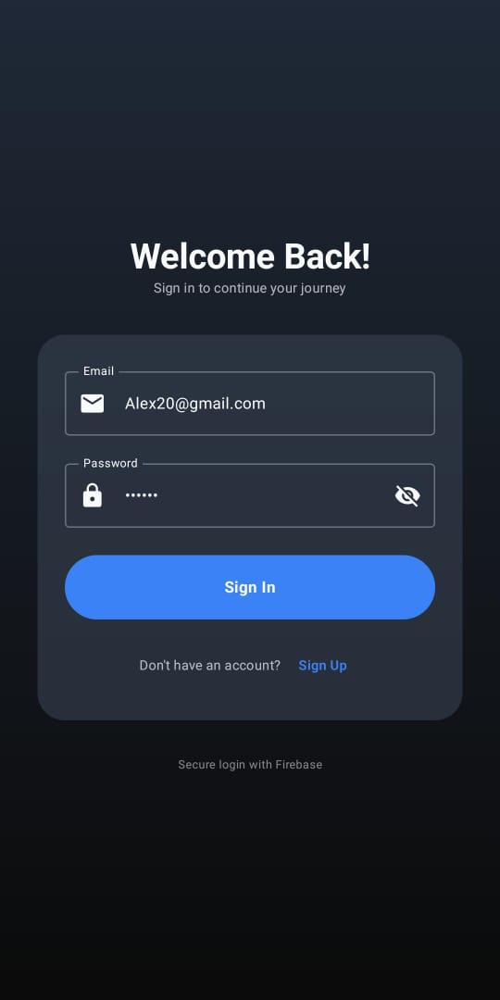
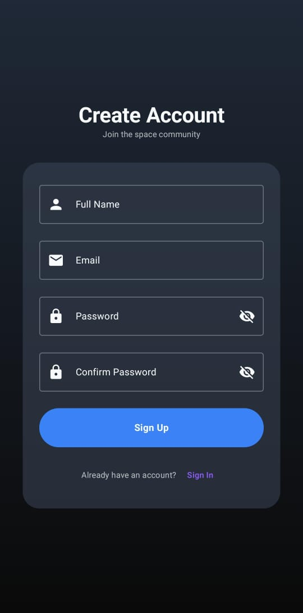
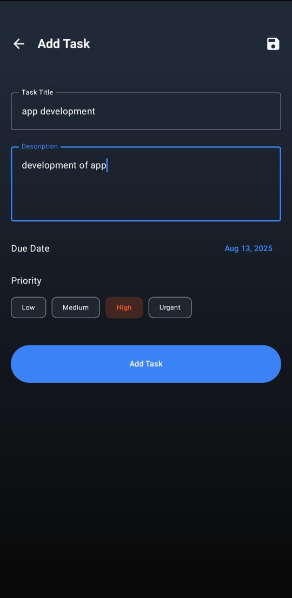
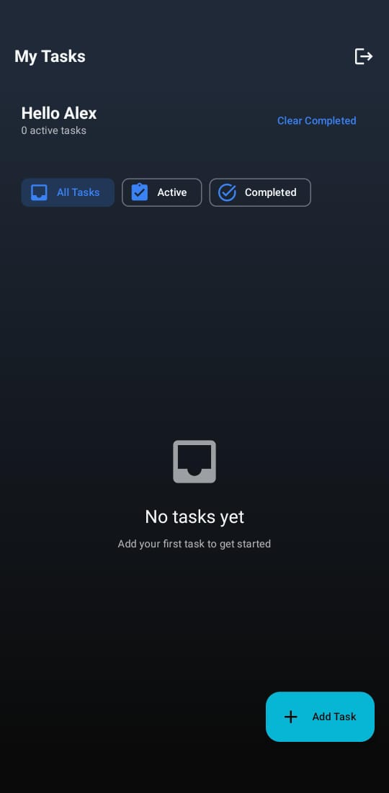
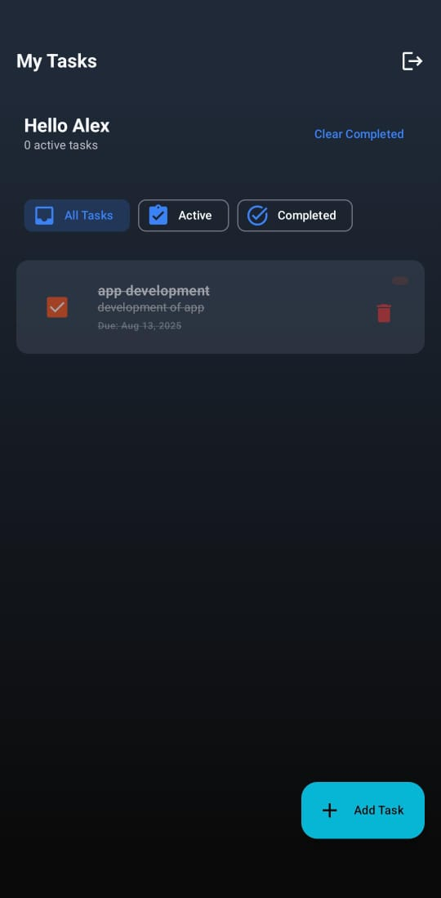
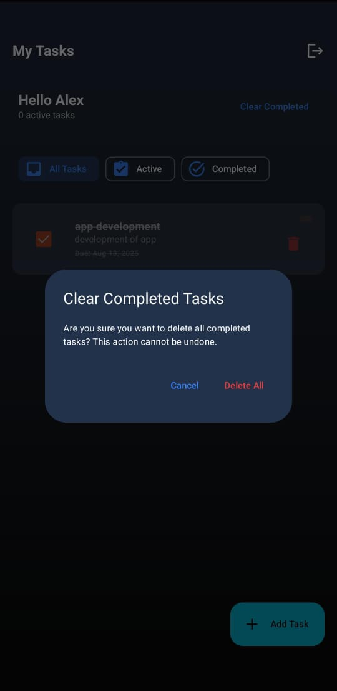

# 🔐 Taskify with Firebase Authentication  
**"Secure your tasks, secure your flow – powered by Firebase!"**

---

## 🚀 What is Taskify with Firebase?

Taskify has been enhanced with **Firebase Authentication** and **Firebase Realtime Database** to provide secure, real-time user login and registration.  
This version builds upon the Taskify UI/UX while introducing a robust authentication layer — all with **Jetpack Compose** and **MVVM architecture**.

---

## 🎬 App Preview  
👇 Curious how it looks?

  

---

## ✍️ Core Features

| 🔐 Feature             | 📝 Description                                                                 |
|------------------------|--------------------------------------------------------------------------------|
| 🧾 Register New User    | Email/password registration via Firebase Auth                                  |
| 💾 Store Profile Data   | Saves name & email to Firebase Realtime Database                               |
| 🔑 Login Existing User  | Validates user via Firebase Auth, fetches profile info                         |
| 🛠️ Form Validation     | Validates fields, shows loading & error states                                 |
| 🔄 Integrated Flow      | Navigates from Login/Register → Task Screen on success                         |
| 📱 Jetpack Compose UI   | Intuitive, modern design with clean input fields                               |
| 🚦 Navigation           | Navigation between screens using Compose Navigation                            |

---

## 🧱 Tech Stack Breakdown

| Layer              | Tools Used                                |
|--------------------|--------------------------------------------|
| 🎨 UI Design       | Jetpack Compose                            |
| 🧠 Architecture    | MVVM + ViewModel + StateFlow               |
| 🔐 Auth System     | Firebase Authentication                    |
| ☁️ Database        | Firebase Realtime Database                 |
| 🔄 Navigation      | Jetpack Navigation for Compose             |

---
## 📸 App Screenshots

| Login Screen | Register Screen |
|--------------|-----------------|
|  |  |

| Add Task | View Tasks |
|----------|------------|
|  |  |

| Completed Task | Clear Tasks |
|----------------|-------------|
|  |  |

---

## 📸 App Highlights

- 🪐 **All Tasks Screen** – View everything in card format  
- 📝 **Task Editor** – Create or modify task details  
- 🎨 **Priority Indicator** – Visual priority badges  
- ✔️ **One-tap Complete** – Flip status with a toggle  
- 🌙 **Dark Mode UI** – Inspired by outer space colors  

---

## 📁 Project Structure

| 📂 File               | 🧩 Responsibility                             |
|----------------------|----------------------------------------------|
| `LoginScreen.kt`     | UI + logic for Firebase login                |
| `RegisterScreen.kt`  | UI + logic for registration + DB write       |
| `User.kt`            | Data class for user profile                  |
| `AuthViewModel.kt`   | Handles auth logic with Firebase             |
| `FirebaseRepository.kt` | Reusable functions for login/register     |
| `MainActivity.kt`    | App launch point                             |
| `NavGraph.kt`        | Navigation setup between screens             |
| `TaskListScreen.kt`  | Main task dashboard after login              |

---

## 🌟 Why Try Taskify?

✨ Minimal yet modern UI  
🧭 Seamless user flow with navigation  
📶 Offline access using Room  
🧰 Good starter for learning Compose + MVVM  
💼 Perfect addition to your Android dev portfolio

---

🔗Made with Kotlin and compose magic by Laiba [https://github.com/Laiba-Usman]
